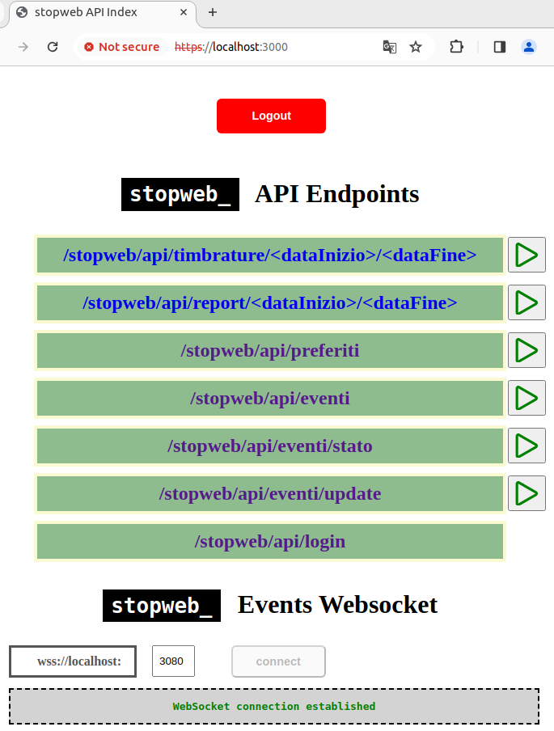

# Stopweb (CLI)




## Variabili d'ambiente
Il progetto utilizza le seguenti variabili d'ambiente:

| Nome                          | Descrizione                         | Valore Default                                 |
| ----------------------------- | ------------------------------------| -----------------------------------------------|
| STOPWEB_PROFILI_BASEDIR_PATH  | Il path dei profili                 | ~/.stopweb/profili                             |

## Pre-requisiti
- Installa [Node.js](https://nodejs.org/en/) versione v18.19.1

## Per iniziare
- Clona il repository
```bash
git clone https://github.com/diego-devita/stopweb.git
```
- Installa le dipendenze
```bash
cd <stopweb directory>
sudo npm install
```
- Crea il symlink **stopweb** allo script entry point (`./src/cli.js`)
```bash
cd <stopweb directory>
sudo npm link
```

- Installa Chromium (verrà usato con Playwright alla login)

per maggiori dettagli: https://playwright.dev/docs/browsers

```bash
sudo npx playwright install chromium

#oppure per forzare le dipendenze
sudo npx playwright install --with-deps chromium
```

- Crea il certificato SSL (http api e web socket)

I file certificato sono chiave pubblica e chiave privata necessarie ad abilitare il canale SSL over HTTP e WS. Se i file non esistono, SSL non è disponibile e neppure l'autenticazione a valle. I file sono: `key.pem` e `cert.pem` in `<profilo>/config/`.

Per creare i certificati (**self-signed!**):
```bash
openssl req -x509 -newkey rsa:4096 -keyout key.pem -out cert.pem -days 365 -nodes -subj "/C=IT/ST=Italy/L=Rome/O=stopweb/OU=stopweb/CN="
```

- Crea un file con le API KEYS (http api e web socket)

Il file `<profilo>/config/validapikeys` è un array di stringhe serializzato in JSON. Tutte le stringhe che contiene sono chiavi valide per l'autenticazione nel portale api e per la connessione con il web socket. Se il file non esiste o non è deserializzabile, l'autenticazione è spenta.


## Creare la configurazione profilo

- Inizializza la configurazione del profilo corrente
```bash
stopweb profilo --init
```
- Imposta le api url con il proprio sito aziendale
```bash
stopweb profilo --seturls <nomesito>
```
- Consulta le condizioni di utilizzo
```bash
stopweb condizioni
```
- Accetta le condizioni di utilizzo
```bash
stopweb condizioni --accetta
```
## License and Attributions

The license for this project can be found in the [LICENSE](./LICENSE.txt) file.
Attributions for third-party components used by this project are located in [legal/ATTRIBUTIONS.md](./legal/ATTRIBUTIONS.md).